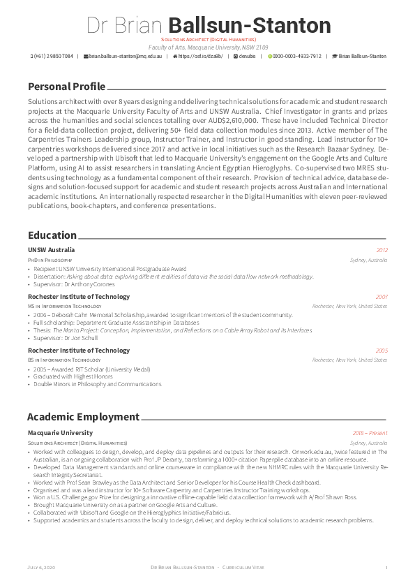
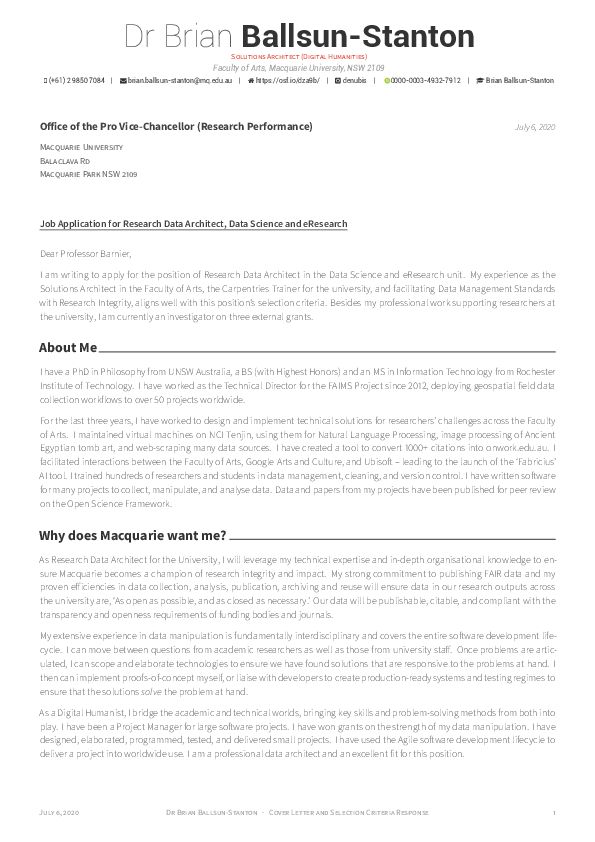

# Academic CV and coverletter with BibTeX and CSV support for grants and projects.

Takes CSV files of projects, grants, and presentations, and bibtex files of publications and integrates them smoothly into cv and resume formats. Also supports a coverletter in the same style.

With multi-source inputs in `data/` -- I try to preserve a single source of truth.

[My public resume](documents/resume.pdf)

  <h2>CV</h2>
  <a href="documents/cv.pdf">Public CV</a>
  

  <h2>Cover Letter</h2>
<a href="documents/coverletter.pdf">Public Cover Letter</a>

Based on <a href="https://github.com/posquit0/Awesome-CV">@posquit0's Awesome-CV </a>
